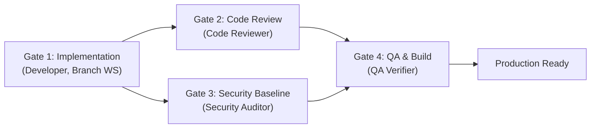

# Multi-Agent Software Development Lifecycle (SDLC) Rulebook

This repository is governed by an **autonomous Multi-Agent Software Development Framework**. All agents and subagents operating within this workspace must strictly adhere to this rulebook.

---

## 1. Core Architecture & Mental Model

Software engineering in this codebase is structured around rigorous design, distinct sign-off gates, automated testbenches, and client-side security baselines:

```
[Spec & Architecture] --> [UI/UX Design] --> [Implementation] --> [Scalability & Code Review] --> [Security Baseline Audit] --> [QA Verification]
 (Lead Orchestrator)      (UI/UX Architect)     (Developer)              (Code Reviewer)              (Security Auditor)          (QA Verifier)
```

---

## 1.1 Orchestrator Governance & Separation Invariant

To maintain clean separation of concerns:
1. **Strict Orchestrator Hands-Off Rule**:
   - The Lead Orchestrator is **STRICTLY FORBIDDEN** from directly modifying project source code (`src/**`, `scripts/**`) for multi-domain features or refactors.
   - The Orchestrator's sole authority is: (1) Architecture/Task decomposition, (2) Subagent dispatching, and (3) Gate sign-off arbitration.
2. **Distinct Verification Gates & Branch Isolation**:
   - Feature development subagents run in isolated branch workspaces (`Workspace: 'branch'`).
   - Code Review, Security Audit, and QA Verification **MUST ALWAYS** be executed by distinct subagents. Self-review by the Orchestrator or authoring subagent is strictly forbidden.
3. **Optimized Concurrent Pipeline**:
   - Routine development flows through the concurrent pipeline (**Gate 1 Developer → [Gate 2 Code Reviewer + Gate 3 Security Auditor in Parallel] → Gate 4 QA Verifier → Done**).
   - Extra adversarial swarms (challengers/forensic auditors) are reserved strictly for meta-layer framework restructures, not routine application features.

---

## 2. The Standard Quality Gate Pipeline



### Stage 1: Specification & Contract (Lead Orchestrator)
* Deconstruct high-level goals into modular tasks and interfaces.
* Define strict API contracts, data schemas (Zod/TypeScript), and acceptance criteria upfront.
* Define performance budgets ($O(N)$ algorithmic complexity, memory bounds).

### Stage 2: UI/UX & Human Factors (UI/UX Architect Subagent)
* **Mobile-First & Touch Ergonomics**: Minimum $48 \times 48\text{px}$ touch targets, thumb-friendly navigation, notch/safe-area insets.
* **Bilingual RTL/LTR Symmetry**: Pixel-perfect layout mirroring between Hebrew (RTL) and English (LTR) using CSS logical properties.
* **Accessibility**: Strict WCAG 2.2 AAA color contrast, focus states, and semantic ARIA tree.

### Stage 3: Implementation (Developer & Component Specialists)
* **`developer` / `ui_ux_specialist` / `auth_cloud_specialist` / `delivery_pipeline_specialist` / `pwa_offline_specialist`**:
  * Follow Clean Architecture: decouple Presentation, Domain Logic, and Storage Adapters.
  * Co-locate unit tests alongside implementation (`*.test.jsx`, `*.test.js`).
  * Guard cloud free-tier quotas (Firebase Spark read/write budgets, IndexedDB client caching).

### Stage 4: Scalability & Peer Code Review (Code Reviewer Subagent)
* **Scope Challenge (Mandatory)**: Before flagging an issue, state in one line why it matters *for this specific app at its current stage*. Non-blocking items are logged to `DEFERRED.md`.
* **Algorithmic Complexity**: Verify $O(1)$ or $O(N)$ operations. Flag nested loop lookups ($O(N^2)$) and quadratic spreads.
* **Memory & Lifecycle**: Verify explicit cleanup of timers, event listeners, and `AbortController` instances on unmount.
* **Specialist Consultation**: Check domain-specific invariants for Auth, Delivery, UI/UX, and PWA files.

### Stage 5: Security Baseline Audit (Security Auditor Subagent)
* **Deliveree Security Baseline (Client-Only PWA)**:
  * *Re-adopt ASVS L2/L3 language only if/when a real backend or auth server is introduced.*
  * **Firestore BOLA Invariant**: Rule `update` must enforce `resource.data.userId == auth.uid && request.resource.data.userId == auth.uid`.
  * **Anti-ReDoS**: Deterministic regex patterns without nested unanchored quantifiers.
  * **Input Parsing**: Strict schema allowlisting (Zod `strip()`) and prototype pollution guards.
  * **Client Web APIs**: Safe `FileReader` limits ($\le 2\text{MB}$) and clipboard fallback.
  * **Secrets Check**: Zero hardcoded credentials or API keys in source files or client bundles.

### Stage 6: QA & Build Verification (QA Verifier Subagent)
* Static analysis: `npm run lint` (exit 0). **Not** `oxlint -D warnings` — the
  `react-perf` rules run at `warn` deliberately, as a worklist rather than a
  gate, so a blanket warning-denial reports another agent's backlog as your
  failure. See §9.1.
* Typecheck: `tsc --noEmit --strict`
* 5-Tier Testbench: `npm test` (100% pass rate)
* Anti-facade scan: Verify zero dummy assertions (`expect(true).toBe(true)`) or skipped tests (`it.skip`).
* Production build: `npm run build` (zero build warnings or errors).

---

## 3. Autonomous Subsystem Specialists

Domain specialists own and maintain invariants for specific subsystems:
- **`auth_cloud_specialist`**: AuthContext, Firebase Auth state, Firestore security rules, Spark quota optimizations.
- **`delivery_pipeline_specialist`**: Package lifecycle, Zod schema validation, carrier detection regexes, smartParser.
- **`ui_ux_specialist`**: Layout, mobile touch targets ($\ge 48\text{px}$), Hebrew RTL / English LTR symmetry.
- **`pwa_offline_specialist`**: Service worker, offline resilience, and cache synchronization.
- **`feedback_telemetry_specialist`**: Feedback modal, Firestore feedback, Telegram bot relays.

---

## 4. Governance, Remediation & Circuit Breaker

1. **Independent Verification**: Authoring agents are strictly prohibited from approving their own reviews or verification gates.
2. **Bounded Remediation ($N \le 3$)**:
   - Failing gates are returned to the developer with exact file, line, and remediation instructions.
   - Maximum 3 retries per gate before logging the failure to `DEAD_ENDS.md` and escalating to the user.
3. **Structured JSON Communication**: Subagents communicate using structured envelopes.

---

## 5. Non-Negotiable Sign-Off Criteria

No feature or change is approved if:
1. Any automated test fails.
2. The linter or typechecker emits errors or warnings.
3. The build fails or emits critical errors.
4. Any Deliveree Security Baseline vulnerability is detected.
5. An uncontrolled $O(N^2)$ algorithm or memory leak is introduced.
6. Mobile touch targets fall below $48\text{px}$ or RTL/LTR mirroring is broken.

---

## 6. Custom Skill Discovery

The specialized skills governing this workspace are located in `.agents/skills/`:
* [`git-branch-and-pr-workflow`](.agents/skills/git-branch-and-pr-workflow/SKILL.md)
* [`sdlc-orchestrator`](.agents/skills/sdlc-orchestrator/SKILL.md)
* [`software-development-standards`](.agents/skills/software-development-standards/SKILL.md)
* [`automated-code-review`](.agents/skills/automated-code-review/SKILL.md)
* [`owasp-security-and-rate-limiting`](.agents/skills/owasp-security-and-rate-limiting/SKILL.md)
* [`software-verification-and-qa`](.agents/skills/software-verification-and-qa/SKILL.md)
* [`remote-notifications-and-chat`](.agents/skills/remote-notifications-and-chat/SKILL.md)
* [`feedback-triage-and-action-items`](.agents/skills/feedback-triage-and-action-items/SKILL.md)
* [`project-release-tracking`](.agents/skills/project-release-tracking/SKILL.md)

---

## 7. Operational Facts (verified 2026-08-24)

Ground truth about this repository's toolchain, gathered by hitting each of these
the hard way. Prefer this section over inference — several items contradict what
a reasonable person would assume from reading the source.

### 7.1 Pre-submit CI, and how to declare a change

`.github/workflows/ci.yml` runs: **Require Change Declaration**, **Lint Check**,
**Automated Unit & Integration Tests**, **Cloud Functions Lint & Tests**,
**Production Build Verification**, **Deploy to Firebase Hosting** (skipped on
PRs), and **GitGuardian Security Checks**.

**A PR that changes shipped code must declare the change.** "Shipped code" means
`src/`, `functions/`, or `firestore.rules` — all three change deployed
behaviour. Two ways to satisfy it:

1. **Add a changeset** (preferred) — a new `.changes/<slug>.md` file with
   `type: major|minor|patch` front matter and a one-or-two-sentence description.
   See `.changes/README.md`. New files never conflict between parallel PRs.
2. **Bump `package.json`'s version** directly. Still valid, and fine for a
   one-off hotfix that ships immediately.

If a bump is present it must be a **legal successor** of the base branch's
version, not merely larger — the same three-option rule the release script
applies.

`npm run release` then collects the changesets, writes the `CHANGELOG.md`
entry, updates `package.json`, and deletes the files it consumed. That commit
is the release — and **only the release commit deploys**: CI ships a push to
`main` only when it changes the version, so an ordinary merge lands without
deploying.

The release version may be derived (`npm run release`) or stated
(`npm run release 0.16.0`). A stated version must be a **legal successor** —
from `0.6.4` only `0.6.5`, `0.7.0` or `1.0.0`; never `0.6.99` or `0.9.0` — and
at least as large as the changesets imply. `scripts/version-utils.mjs` holds
that rule once and is shared by the release script and the pre-submit gate, so
the two cannot disagree.

**Do not hardcode the version anywhere.** `src/constants/version.js` reads
`__APP_VERSION__`, injected from `package.json` by `vite.config.js` and
`vitest.config.js`, and the two tests that check it compare against
`package.json` rather than a literal. There is exactly one place the version is
defined.

#### Why this replaced "every src/ PR must bump"

The previous gate required a version bump in every PR touching `src/`. It was
miscalibrated in both directions: too strict for internal refactors that ship
identical behaviour, and too loose because it ignored `functions/` and
`firestore.rules` entirely.

Worse, it forced every PR to touch the same four files — `package.json`, both
version-asserting tests, and `CHANGELOG.md` — so **merging any PR immediately
conflicted every sibling PR in all four**. In a four-PR wave that cost a rebase
round-trip per merge. It also turned the version into a PR counter: `0.15.3` to
`0.15.7` in a single session, none of which was a release.

It additionally tested only that head and base versions *differed*, so a PR
carrying a lower version passed and would have regressed `main` on merge. That
happened once, with pre-allocated versions merged out of order, and was caught
by hand rather than by CI.

### 7.2 A conflicted PR produces no CI run at all

`pull_request` events build against the **merge commit** (`refs/pull/N/merge`),
not your branch tip. When a PR conflicts with its base, GitHub cannot compute
that ref, so **zero workflow jobs are created**. The PR shows as failing but
nothing ran.

The tell: only **GitGuardian Security Checks** reports green. It is a GitHub App
that scans pushed commits directly, bypassing the merge ref. One lone green
check means "conflicted", not "partially passed". Resolve the conflict and CI
runs.

### 7.3 Check runs appear progressively — do not read an early snapshot

`Production Build Verification` declares `needs: [lint, test]`, and the deploy
job needs the build. Query check runs too early and you get four or five jobs
and none of the ones that gate on others. **Wait for all seven to reach a
terminal state** before calling a PR green.

### 7.4 The production build DOES run locally — use it

`npm run build` requires `VITE_FIREBASE_API_KEY`, `..._AUTH_DOMAIN`,
`..._PROJECT_ID`, `..._STORAGE_BUCKET`, `..._MESSAGING_SENDER_ID` and
`..._APP_ID`. `vite.config.js` fails the production build when any is missing
or contains whitespace — a guard added after a trailing CRLF in `authDomain`
broke Google sign-in in production.

**That guard checks presence and whitespace only, not validity.** So dummy
values produce a real build with real chunk output:

```bash
VITE_FIREBASE_API_KEY=x VITE_FIREBASE_AUTH_DOMAIN=x VITE_FIREBASE_PROJECT_ID=x \
VITE_FIREBASE_STORAGE_BUCKET=x VITE_FIREBASE_MESSAGING_SENDER_ID=x \
VITE_FIREBASE_APP_ID=x npx vite build
```

Use this. It is the only way to see bundle sizes, chunk splits, and Rolldown's
warnings — `INEFFECTIVE_DYNAMIC_IMPORT` in particular, which silently reports a
dynamic import defeated by a static one elsewhere and is invisible to lint and
tests.

**This section previously said the build could not run locally. That was
wrong**, and several agents skipped local build verification because of it. If
you are changing bundling, chunking or imports, build locally before you push;
CI proves the production numbers, but it should not be where you first learn
your split did not work.

### 7.5 Known-flaky tests — wall-clock assertions

`src/utils/adversarialStress.test.js:33,297,308,329` and
`src/utils/adversarialP0Audit.test.js:40` assert elapsed duration
(`expect(duration).toBeLessThan(100)`). Under a loaded runner these fail
intermittently and the failure looks like it belongs to whoever's PR was
running.

If you see exactly one failure in an otherwise-green suite **and** the run took
far longer than the usual ~25s, check whether it is one of these before
investigating your own diff. Do not use this as a general licence to dismiss
failures: any other test failing is real.

---

## 7.6 Coordinating with agents outside this system

More than one agentic system may be working in this repository at the same
time, with no shared context between them. **Issue #64 is the ownership
ledger — read it before touching any file, and update it when you claim or
release files.**

Claim before you start, not when you open the PR. If a file you need is
already claimed, comment on #64 rather than editing it. If a fix turns out to
need a file you do not own, say so there instead of reaching for it.

Announce interface changes on #64 before they merge — a changed return shape
or exported signature reaches whoever consumes it, and they have no way to see
it coming. `src/hooks/usePackages.js` is the most likely instance: its
internals and its consumers sit on opposite sides of the usual split.

To report a defect in code another owner shipped, open a normal issue and link
it from #64. It is theirs to fix; finding it is not the same as owning it.

---

## 8. Parallel-Agent Protocol

When several agents work concurrently, coordination failures — not coding
mistakes — are the dominant cost. These rules come from a four-agent wave.

### 8.1 Group work by file ownership, never by subject

Assign each agent an **exclusive** file list. One file has exactly one owner per
wave. Where two tasks need the same file, either merge them into one agent or
put them in different waves.

Subject-based grouping fails here because the hot files are shared across
concerns: `App.jsx`, `packageValidator.js`, `usePackages.js`,
`cloudStorageAdapter.js`, and `AuthContext.jsx` are each touched by several
otherwise-unrelated tasks.

Instruct agents: **if a fix seems to require a file you do not own, stop and
report it — do not reach outside your list.** A gap reported is cheaper than a
merge conflict. Note the corollary risk: a bug spanning two owners can fall
between them and survive both PRs. Assign such fixes at their *source* (the
shared function) rather than at each call site.

### 8.2 Always re-derive the base; never trust a handed-down SHA

`main` moves during a wave. Instruct every agent to run `git fetch origin main`
and branch from it itself, rather than accepting a base commit named in its
brief. Before pushing, fetch again and rebase if the base moved, then **re-run
lint and tests after the rebase** — a green suite from before proves nothing.

### 8.3 Declare changes with changesets, not version bumps

Use a `.changes/<slug>.md` changeset (§7.1) rather than bumping `package.json`.
Name the slug after your branch so parallel agents cannot collide.

This removes what used to be the largest coordination cost in a wave: because
the old gate forced every PR to edit the same four files, merging one PR
conflicted every sibling in all four, every time. Changesets are new files, so
they never conflict with each other.

If you do bump directly, allocate versions in the intended **merge order** and
make sure yours stays above the base — and re-check after each sibling merges,
since a pre-allocated number goes stale the moment merge order changes.

### 8.4 Agents cannot see CI

Agent environments have no `gh` CLI. An agent can push but cannot observe
whether what it pushed passed. **Verification is the orchestrator's job** — make
it explicit rather than assuming the agent will confirm.

### 8.5 Review must be independent, and must not be given the plan

Use a separate reviewer that receives the PR and the repository but **not** the
plan, the task IDs, the rationale, or the orchestrator's expectations. Anchoring
a reviewer on intent turns it into a checker of compliance rather than of
correctness.

Give the reviewer three standing instructions:
* Judge the diff, not the PR description.
* Treat a green suite as weak evidence — the tests were written by the same
  party that wrote the code. Look for deleted, skipped, weakened, or
  self-asserting tests.
* Assess claimed evidence rather than accepting it (e.g. verify a
  characterization corpus actually reaches the branches it claims to cover).

One reviewer across all PRs in a wave beats one per PR: it applies a consistent
standard and catches interactions that only appear when several PRs merge
together.

---

## 9. Codebase Gotchas

Non-obvious facts that have already caused, or nearly caused, incorrect changes.

* **`src/types/stages.js` is not the source of valid statuses.** `STAGES`
  defines six ids and omits both `exception` and `archived`. Deriving
  `VALID_STATUSES` from it silently narrows validation and corrupts packages in
  those states. The canonical list lives in `src/utils/packageValidator.js`.

* **`CARRIERS[id]` is unsafe for untrusted ids.** `CARRIERS['constructor']`
  returns `Object.prototype.constructor` — truthy — so the common
  `CARRIERS[id] || CARRIERS['other']` fallback is skipped. Use the `getCarrier()`
  accessor in `src/types/carriers.js`, which does an own-property check. The
  unsafe pattern still exists at roughly twelve call sites across components and
  utils, plus `src/App.jsx:279` which has no fallback at all.

* **Archived packages never leave the list.** Archiving flips `isArchived`; the
  record stays in the same array and the same storage blob, and there is no
  retention or eviction policy anywhere. Every cost — validation sweeps, storage
  size, sync volume — scales with *lifetime* packages created, not active ones.

* **`src/services/idbStorageAdapter.js` no longer exists** (removed in `0.15.3`;
  it had zero non-test importers). Do not reintroduce it or cite it. `README.md`
  and `PROJECT_STATE.md` may still reference it — those references are stale.

* **Apple and Facebook auth are not wired up.** The UI was deliberately removed;
  `src/services/firebase.js` may still construct the providers, but no reachable
  path uses them.

* **`package-lock.json`'s `version` field has drifted** from `package.json`
  across many releases. It is cosmetic (npm does not read it for resolution) but
  is a recurring source of confusion.

### 9.1 Module layering, and what actually enforces it

The layering below used to be convention only, and it eroded: `packageSchema`
and `packageValidator` imported each other (a real cycle, since fixed), and
`README.md` described a storage hierarchy that did not exist at runtime. A
convention nothing checks is a convention that decays silently, so `.oxlintrc.json`
now enforces the parts oxlint can express. No new dependency was added — oxlint
v1.75 does all of this natively.

**The layers.** Each may import the ones below it and third-party code, never
the ones above:

```
components/ · hooks/ · context/     (presentation & React state)
services/                           (Firebase, network, adapters)
utils/ · types/ · schemas/ · constants/ · i18n/ · data/   (leaves)
```

**Enforced (`error`, fails CI):**

* `import/no-cycle` — repo-wide. It reported zero violations when enabled, so
  this is a free ratchet: it costs nothing today and prevents recurrence of a
  bug this codebase actually had.
* `no-restricted-imports` in `src/utils|types|schemas|constants|i18n|data/**` —
  cannot import `services/`, `components/`, `hooks/` or `context/`.
* `no-restricted-imports` in `src/services/**` — cannot import `components/`,
  `hooks/` or `context/`.
* `no-restricted-imports` in `src/components|hooks|context/**` plus `App.jsx`
  and `main.jsx` — cannot reach into a nested path under `services/`, `utils/`,
  `types/`, `schemas/`, `constants/`, `i18n/` or `data/` (import a module's
  public surface, not a file inside it).

The bans match the directory form too (`'../services'`, not just
`'../services/x'`), so introducing a barrel file is not a way around them.

All of these were already clean on `main`; they lock in the status quo rather
than demanding a migration. Test files are excluded from the layering
overrides — a test legitimately reaches across layers to build fixtures.

**Documented only, not enforced:** "a component must not import another
component's internals." oxlint has no `import/no-restricted-paths`, and
`no-restricted-imports` matches the import *specifier*, not the importing
file's position relative to it — so a rule of the form "A may not import B's
private files" is not expressible. It is also currently moot: every component
is a single flat file with no internals to reach into. **Do not add ESLint as a
second linter to close this gap.** Two linters, two configs and a second CI step
is a large standing cost for one rule that no code currently violates.

**`react-perf` is a worklist, not a gate.** The four `react-perf/jsx-no-new-*`
rules run at `"warn"` (265 findings at the time of writing, all react-perf; no
other rule warns). `npm run lint` — what CI runs — exits `0` with warnings
present, so these do not block a merge, deliberately: a warning here is a
*candidate*, not a defect. An inline arrow passed to a memoized list item
rendered 200 times is worth fixing; the same arrow on a single button is noise,
and "fixing" it with a `useCallback` makes the code worse. Judge each one.

For the same reason, **do not run `oxlint -D warnings` as a blanket gate.**
It exits 1 on this tree. Every gate description that used to prescribe it —
§2 Stage 6, `.agents/rules/sdlc_pipeline.md` Gate 4, and the
`software-verification-and-qa` and `project-release-tracking` skills — now says
`npm run lint`, which is what CI actually runs. Otherwise the next agent
running the QA skill on an unrelated PR reports FAIL on a backlog that is not
theirs.

**Every directory under `src/` is assigned to a layer**, deliberately, so a new
one cannot appear unconstrained. Two decisions worth stating:

* `src/App.jsx` and `src/main.jsx` are the **composition root**. They are the
  one place allowed to reach into every layer at once — that is their job — so
  they are exempt from the layer bans, but they *are* covered by the
  public-surface rule.
* `src/data/**` is a **leaf** (static seed data), grouped with `utils/`.

**The enforcement is tested, because it fails open.** The tree is 100%
compliant, so a config that has silently stopped working looks exactly like a
clean tree: `npm run lint` exits 0 either way. Renaming `regex` to `regexp`
makes a real violation lint clean with no diagnostic anywhere.
`.agents/lint/lintBoundaries.test.js` therefore lints deliberately-broken
fixtures in `.agents/lint/fixtures/` with the real rules and fails if they come
back clean. It runs in `npm test`. If you change `.oxlintrc.json`'s layering
rules, that test is what proves the change still enforces something.

Two mechanics that are easy to get wrong and are guarded by that test: oxlint
resolves an override's `files` globs **relative to the config file's own
directory** (a config in a temp dir matches nothing and skips every override
silently), and the patterns are anchored to the relative form `^(\.\.?/)+` so
that a third-party subpath like `some-lib/hooks/useX` is not mistaken for a
layer violation.
