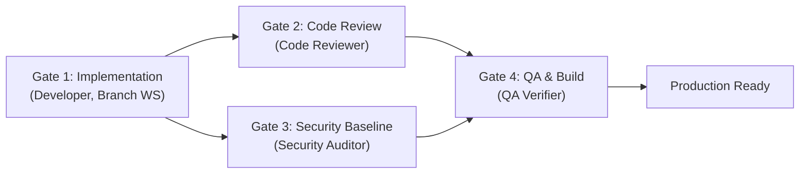

# Multi-Agent Software Development Lifecycle (SDLC) Rulebook

This repository is governed by an **autonomous Multi-Agent Software Development Framework**. All agents and subagents operating within this workspace must strictly adhere to this rulebook.

---

## 1. Core Architecture & Mental Model

Software engineering in this codebase is structured around rigorous design, distinct sign-off gates, automated testbenches, and client-side security baselines:

```
[Spec & Architecture] --> [UI/UX Design] --> [Implementation] --> [Scalability & Code Review] --> [Security Baseline Audit] --> [QA Verification]
 (Lead Orchestrator)      (UI/UX Architect)     (Developer)              (Code Reviewer)              (Security Auditor)          (QA Verifier)
```

---

## 1.1 Orchestrator Governance & Separation Invariant

To maintain clean separation of concerns:
1. **Strict Orchestrator Hands-Off Rule**:
   - The Lead Orchestrator is **STRICTLY FORBIDDEN** from directly modifying project source code (`src/**`, `scripts/**`) for multi-domain features or refactors.
   - The Orchestrator's sole authority is: (1) Architecture/Task decomposition, (2) Subagent dispatching, and (3) Gate sign-off arbitration.
2. **Distinct Verification Gates & Branch Isolation**:
   - Feature development subagents run in isolated branch workspaces (`Workspace: 'branch'`).
   - Code Review, Security Audit, and QA Verification **MUST ALWAYS** be executed by distinct subagents. Self-review by the Orchestrator or authoring subagent is strictly forbidden.
3. **Optimized Concurrent Pipeline**:
   - Routine development flows through the concurrent pipeline (**Gate 1 Developer → [Gate 2 Code Reviewer + Gate 3 Security Auditor in Parallel] → Gate 4 QA Verifier → Done**).
   - Extra adversarial swarms (challengers/forensic auditors) are reserved strictly for meta-layer framework restructures, not routine application features.

---

## 2. The Standard Quality Gate Pipeline



### Stage 1: Specification & Contract (Lead Orchestrator)
* Deconstruct high-level goals into modular tasks and interfaces.
* Define strict API contracts, data schemas (Zod/TypeScript), and acceptance criteria upfront.
* Define performance budgets ($O(N)$ algorithmic complexity, memory bounds).

### Stage 2: UI/UX & Human Factors (UI/UX Architect Subagent)
* **Mobile-First & Touch Ergonomics**: Minimum $48 \times 48\text{px}$ touch targets, thumb-friendly navigation, notch/safe-area insets.
* **Bilingual RTL/LTR Symmetry**: Pixel-perfect layout mirroring between Hebrew (RTL) and English (LTR) using CSS logical properties.
* **Accessibility**: Strict WCAG 2.2 AAA color contrast, focus states, and semantic ARIA tree.

### Stage 3: Implementation (Developer & Component Specialists)
* **`developer` / `ui_ux_specialist` / `auth_cloud_specialist` / `delivery_pipeline_specialist` / `pwa_offline_specialist`**:
  * Follow Clean Architecture: decouple Presentation, Domain Logic, and Storage Adapters.
  * Co-locate unit tests alongside implementation (`*.test.jsx`, `*.test.js`).
  * Guard cloud free-tier quotas (Firebase Spark read/write budgets, IndexedDB client caching).

### Stage 4: Scalability & Peer Code Review (Code Reviewer Subagent)
* **Scope Challenge (Mandatory)**: Before flagging an issue, state in one line why it matters *for this specific app at its current stage*. Non-blocking items are logged to `DEFERRED.md`.
* **Algorithmic Complexity**: Verify $O(1)$ or $O(N)$ operations. Flag nested loop lookups ($O(N^2)$) and quadratic spreads.
* **Memory & Lifecycle**: Verify explicit cleanup of timers, event listeners, and `AbortController` instances on unmount.
* **Specialist Consultation**: Check domain-specific invariants for Auth, Delivery, UI/UX, and PWA files.

### Stage 5: Security Baseline Audit (Security Auditor Subagent)
* **Deliveree Security Baseline (Client-Only PWA)**:
  * *Re-adopt ASVS L2/L3 language only if/when a real backend or auth server is introduced.*
  * **Firestore BOLA Invariant**: Rule `update` must enforce `resource.data.userId == auth.uid && request.resource.data.userId == auth.uid`.
  * **Anti-ReDoS**: Deterministic regex patterns without nested unanchored quantifiers.
  * **Input Parsing**: Strict schema allowlisting (Zod `strip()`) and prototype pollution guards.
  * **Client Web APIs**: Safe `FileReader` limits ($\le 2\text{MB}$) and clipboard fallback.
  * **Secrets Check**: Zero hardcoded credentials or API keys in source files or client bundles.

### Stage 6: QA & Build Verification (QA Verifier Subagent)
* Static analysis: `oxlint -D warnings --deny-warnings`
* Typecheck: `tsc --noEmit --strict`
* 5-Tier Testbench: `npm test` (100% pass rate)
* Anti-facade scan: Verify zero dummy assertions (`expect(true).toBe(true)`) or skipped tests (`it.skip`).
* Production build: `npm run build` (zero build warnings or errors).

---

## 3. Autonomous Subsystem Specialists

Domain specialists own and maintain invariants for specific subsystems:
- **`auth_cloud_specialist`**: AuthContext, Firebase Auth state, Firestore security rules, Spark quota optimizations.
- **`delivery_pipeline_specialist`**: Package lifecycle, Zod schema validation, carrier detection regexes, smartParser.
- **`ui_ux_specialist`**: Layout, mobile touch targets ($\ge 48\text{px}$), Hebrew RTL / English LTR symmetry.
- **`pwa_offline_specialist`**: Service worker, offline resilience, and cache synchronization.
- **`feedback_telemetry_specialist`**: Feedback modal, Firestore feedback, Telegram bot relays.

---

## 4. Governance, Remediation & Circuit Breaker

1. **Independent Verification**: Authoring agents are strictly prohibited from approving their own reviews or verification gates.
2. **Bounded Remediation ($N \le 3$)**:
   - Failing gates are returned to the developer with exact file, line, and remediation instructions.
   - Maximum 3 retries per gate before logging the failure to `DEAD_ENDS.md` and escalating to the user.
3. **Structured JSON Communication**: Subagents communicate using structured envelopes.

---

## 5. Non-Negotiable Sign-Off Criteria

No feature or change is approved if:
1. Any automated test fails.
2. The linter or typechecker emits errors or warnings.
3. The build fails or emits critical errors.
4. Any Deliveree Security Baseline vulnerability is detected.
5. An uncontrolled $O(N^2)$ algorithm or memory leak is introduced.
6. Mobile touch targets fall below $48\text{px}$ or RTL/LTR mirroring is broken.

---

## 6. Custom Skill Discovery

The specialized skills governing this workspace are located in `.agents/skills/`:
* [`git-branch-and-pr-workflow`](.agents/skills/git-branch-and-pr-workflow/SKILL.md)
* [`sdlc-orchestrator`](.agents/skills/sdlc-orchestrator/SKILL.md)
* [`software-development-standards`](.agents/skills/software-development-standards/SKILL.md)
* [`automated-code-review`](.agents/skills/automated-code-review/SKILL.md)
* [`owasp-security-and-rate-limiting`](.agents/skills/owasp-security-and-rate-limiting/SKILL.md)
* [`software-verification-and-qa`](.agents/skills/software-verification-and-qa/SKILL.md)
* [`remote-notifications-and-chat`](.agents/skills/remote-notifications-and-chat/SKILL.md)
* [`feedback-triage-and-action-items`](.agents/skills/feedback-triage-and-action-items/SKILL.md)
* [`project-release-tracking`](.agents/skills/project-release-tracking/SKILL.md)

---

## 7. Operational Facts (verified 2026-08-24)

Ground truth about this repository's toolchain, gathered by hitting each of these
the hard way. Prefer this section over inference — several items contradict what
a reasonable person would assume from reading the source.

### 7.1 Pre-submit CI is seven jobs, and one of them is not about code

`.github/workflows/ci.yml` runs: **Require Version Bump**, **Lint Check**,
**Automated Unit & Integration Tests**, **Cloud Functions Lint & Tests**,
**Production Build Verification**, **Deploy to Firebase Hosting** (skipped on
PRs), and **GitGuardian Security Checks**.

**Any PR that changes a file under `src/**` MUST bump the `version` field in
`package.json`, or `Require Version Bump` fails.** This is the single most
common way a correct PR goes red. Running lint and tests locally does not tell
you this — the job compares your `package.json` version against the base
branch's.

Bumping the version requires **four** file edits, not one:

| File | What to change |
|---|---|
| `package.json` | the `version` field |
| `src/constants/version.test.js` | the `expect(APP_VERSION).toBe(...)` literal |
| `src/components/AboutModal.test.jsx` | the same assertion |
| `CHANGELOG.md` | a new `## [x.y.z] - YYYY-MM-DD` entry |

`src/constants/version.js` does **not** hardcode the version — it reads
`__APP_VERSION__`, injected from `package.json` by `vite.config.js` and
`vitest.config.js`. Those two test files are the only places carrying a literal
version string. Bumping `package.json` alone turns the test job red.

Version convention is in `CHANGELOG.md`: PATCH for fixes and internal work,
MINOR for user-facing capability, MAJOR stays `0` during alpha.

### 7.2 A conflicted PR produces no CI run at all

`pull_request` events build against the **merge commit** (`refs/pull/N/merge`),
not your branch tip. When a PR conflicts with its base, GitHub cannot compute
that ref, so **zero workflow jobs are created**. The PR shows as failing but
nothing ran.

The tell: only **GitGuardian Security Checks** reports green. It is a GitHub App
that scans pushed commits directly, bypassing the merge ref. One lone green
check means "conflicted", not "partially passed". Resolve the conflict and CI
runs.

### 7.3 Check runs appear progressively — do not read an early snapshot

`Production Build Verification` declares `needs: [lint, test]`, and the deploy
job needs the build. Query check runs too early and you get four or five jobs
and none of the ones that gate on others. **Wait for all seven to reach a
terminal state** before calling a PR green.

### 7.4 The production build cannot run locally

`npm run build` requires `VITE_FIREBASE_API_KEY`, `..._AUTH_DOMAIN`,
`..._PROJECT_ID`, `..._STORAGE_BUCKET`, `..._MESSAGING_SENDER_ID`, and
`..._APP_ID`. `vite.config.js` deliberately fails the production build when any
is missing or contains whitespace (this guard exists because a trailing CRLF in
`authDomain` once broke Google sign-in in production while email/password kept
working). CI supplies them as repository variables. Locally, `npm run build`
fails identically on unmodified `main` — that failure is not caused by your
change. Rely on CI for build verification.

### 7.5 Known-flaky tests — wall-clock assertions

`src/utils/adversarialStress.test.js:33,297,308,329` and
`src/utils/adversarialP0Audit.test.js:40` assert elapsed duration
(`expect(duration).toBeLessThan(100)`). Under a loaded runner these fail
intermittently and the failure looks like it belongs to whoever's PR was
running.

If you see exactly one failure in an otherwise-green suite **and** the run took
far longer than the usual ~25s, check whether it is one of these before
investigating your own diff. Do not use this as a general licence to dismiss
failures: any other test failing is real.

---

## 8. Parallel-Agent Protocol

When several agents work concurrently, coordination failures — not coding
mistakes — are the dominant cost. These rules come from a four-agent wave.

### 8.1 Group work by file ownership, never by subject

Assign each agent an **exclusive** file list. One file has exactly one owner per
wave. Where two tasks need the same file, either merge them into one agent or
put them in different waves.

Subject-based grouping fails here because the hot files are shared across
concerns: `App.jsx`, `packageValidator.js`, `usePackages.js`,
`cloudStorageAdapter.js`, and `AuthContext.jsx` are each touched by several
otherwise-unrelated tasks.

Instruct agents: **if a fix seems to require a file you do not own, stop and
report it — do not reach outside your list.** A gap reported is cheaper than a
merge conflict. Note the corollary risk: a bug spanning two owners can fall
between them and survive both PRs. Assign such fixes at their *source* (the
shared function) rather than at each call site.

### 8.2 Always re-derive the base; never trust a handed-down SHA

`main` moves during a wave. Instruct every agent to run `git fetch origin main`
and branch from it itself, rather than accepting a base commit named in its
brief. Before pushing, fetch again and rebase if the base moved, then **re-run
lint and tests after the rebase** — a green suite from before proves nothing.

### 8.3 Version bumps guarantee conflicts between sibling PRs

Because §7.1 forces every `src/` PR to touch the same four files, **merging any
PR in a wave immediately conflicts every sibling PR** in all four. This is
structural, not a mistake by any agent.

Mitigations, in order of preference:
1. Allocate a **distinct version per PR up front** (e.g. `0.15.4`, `0.15.5`,
   `0.15.6`) so all siblings pass the gate simultaneously, and fix a merge
   order. Each still needs a rebase after each merge; resolve by keeping your
   own version and preserving **both** CHANGELOG entries.
2. Serialize merges within a wave.
3. Reconsider whether internal-only `src/` changes should require a bump.

### 8.4 Agents cannot see CI

Agent environments have no `gh` CLI. An agent can push but cannot observe
whether what it pushed passed. **Verification is the orchestrator's job** — make
it explicit rather than assuming the agent will confirm.

### 8.5 Review must be independent, and must not be given the plan

Use a separate reviewer that receives the PR and the repository but **not** the
plan, the task IDs, the rationale, or the orchestrator's expectations. Anchoring
a reviewer on intent turns it into a checker of compliance rather than of
correctness.

Give the reviewer three standing instructions:
* Judge the diff, not the PR description.
* Treat a green suite as weak evidence — the tests were written by the same
  party that wrote the code. Look for deleted, skipped, weakened, or
  self-asserting tests.
* Assess claimed evidence rather than accepting it (e.g. verify a
  characterization corpus actually reaches the branches it claims to cover).

One reviewer across all PRs in a wave beats one per PR: it applies a consistent
standard and catches interactions that only appear when several PRs merge
together.

---

## 9. Codebase Gotchas

Non-obvious facts that have already caused, or nearly caused, incorrect changes.

* **`src/types/stages.js` is not the source of valid statuses.** `STAGES`
  defines six ids and omits both `exception` and `archived`. Deriving
  `VALID_STATUSES` from it silently narrows validation and corrupts packages in
  those states. The canonical list lives in `src/utils/packageValidator.js`.

* **`CARRIERS[id]` is unsafe for untrusted ids.** `CARRIERS['constructor']`
  returns `Object.prototype.constructor` — truthy — so the common
  `CARRIERS[id] || CARRIERS['other']` fallback is skipped. Use the `getCarrier()`
  accessor in `src/types/carriers.js`, which does an own-property check. The
  unsafe pattern still exists at roughly twelve call sites across components and
  utils, plus `src/App.jsx:279` which has no fallback at all.

* **Archived packages never leave the list.** Archiving flips `isArchived`; the
  record stays in the same array and the same storage blob, and there is no
  retention or eviction policy anywhere. Every cost — validation sweeps, storage
  size, sync volume — scales with *lifetime* packages created, not active ones.

* **`src/services/idbStorageAdapter.js` no longer exists** (removed in `0.15.3`;
  it had zero non-test importers). Do not reintroduce it or cite it. `README.md`
  and `PROJECT_STATE.md` may still reference it — those references are stale.

* **Apple and Facebook auth are not wired up.** The UI was deliberately removed;
  `src/services/firebase.js` may still construct the providers, but no reachable
  path uses them.

* **`package-lock.json`'s `version` field has drifted** from `package.json`
  across many releases. It is cosmetic (npm does not read it for resolution) but
  is a recurring source of confusion.
